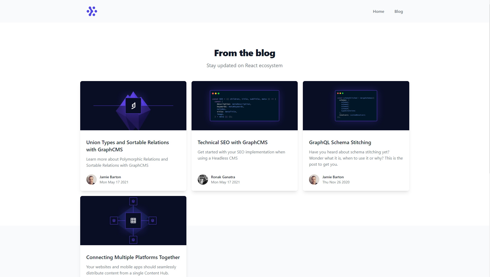

## 📖 Projeto

Este projeto que foi desenvolvido com base em uma live realizada no dia 15/02 no canal da [Rocketseat](https://www.youtube.com/watch?v=f_mFdccIm3U). A finalidade do projeto é introduzir o conceito de JAMStack que, segundo a definição do próprio site: JAMStack é uma arquitetura projetada com foco em desempenho, segurança e escalabilidade. O conceito é baseado em três pontos principais: JavaScript, API e Markup. A aplicação consiste em um Blog criado com Next.js, utilizando um template do TailwindCSS e consumindo a API GraphQL do GraphCMS utilizando o client uQRL. 

## 🧪 Tecnologias

Esse projeto foi desenvolvido com as seguintes tecnologias e bibliotecas:

- [Next.js](https://nextjs.org/)
- [TailwindCSS](https://tailwindcss.com/)
- [GraphQL](https://graphql.org/)
- [uRQL](https://github.com/FormidableLabs/urql)
- [GraphCMS](https://graphcms.com/)


## 🚀 Como executar

Clone o projeto e acesse a pasta do mesmo.

```bash
$ git clone git@github.com:d0ugui/jamstack.git
$ cd jamstack
```

É necessário configurar a conexão com o graphcms
```bash
$ alterar a url de conexão do client dentro de: src/lib/urql.ts 
```

Para iniciá-lo, siga os passos abaixo:

```bash
# Instalar as dependências
$ yarn or npm

# Iniciar o projeto
$ yarn start or npm start
```

O app estará disponível no seu browser pelo endereço http://localhost:3000/

## 📝 License

Esse projeto está sob a licença MIT.